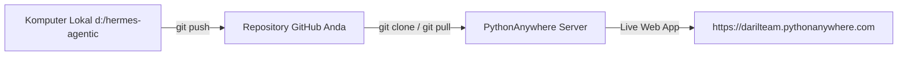

# Panduan Deploy Grok Bot Clone di PythonAnywhere Via GitHub (Git Clone Workflow)

Cara paling praktis, cepat, dan profesional untuk meng-host aplikasi Anda di **PythonAnywhere** adalah menggunakan **GitHub repository** (`git clone` dan `git pull`).

---

## 🚀 Alur Utama Deployment via GitHub



---

## 📦 Langkah 1: Push Kode Lokal ke GitHub

Di terminal komputer Anda (`d:\hermes-agentic`):

```powershell
# 1. Inisialisasi git (jika belum)
git init

# 2. Add semua file proyek
git add .

# 3. Commit awal
git commit -m "Initial commit Grok Bot Clone with Hermes 3 AI"

# 4. Hubungkan ke repository GitHub Anda
git remote add origin https://github.com/daril2work/hermesdarilsteam.git
git branch -M main

# 5. Push ke GitHub
git push -u origin main
```

---

## 🖥️ Langkah 2: Git Clone di PythonAnywhere

1. Log in ke **Dashboard PythonAnywhere**.
2. Buka tab **Consoles**, lalu klik **Bash**.
3. Jalankan perintah `git clone`:
   ```bash
   # Hapus folder lama jika ingin instalasi bersih
   rm -rf ~/hermesdarilsteam

   # Clone repository dari GitHub
   git clone https://github.com/daril2work/hermesdarilsteam.git ~/hermesdarilsteam

   # Masuk ke folder proyek
   cd ~/hermesdarilsteam
   ```

---

## ⚙️ Langkah 3: Buat Virtual Environment & Install Dependensi

Di Bash Console PythonAnywhere (`~/hermesdarilsteam`):

```bash
# Buat virtual environment Python 3.10
mkvirtualenv --python=/usr/bin/python3.10 hermes-env

# Install seluruh dependensi proyek
pip install -r requirements.txt
```

---

## 🔑 Langkah 4: Buat File `.env` di PythonAnywhere

Buat file `.env` di server PythonAnywhere (`nano ~/hermesdarilsteam/.env`):

```env
SUMOPOD_API_BASE=https://ai.sumopod.com/v1
SUMOPOD_API_KEY=masukkan_api_key_anda_di_sini
SUMOPOD_MODEL_NAME=nous-hermes-3
```
*(Tekan `Ctrl+O` lalu `Enter` untuk save, dan `Ctrl+X` untuk keluar dari nano)*

---

## 🌐 Langkah 5: Set Up Web App & WSGI File

1. Buka tab **Web** di PythonAnywhere ➔ Klik **Add a new web app**.
2. Pilih **Manual configuration** ➔ Pilih **Python 3.10**.
3. Set **Source code** dan **Working directory** ke: `/home/darilteam/hermesdarilsteam`
4. Set **Virtualenv path**: `/home/darilteam/.virtualenvs/hermes-env`
5. Edit **WSGI configuration file** (klik link file berakhiran `_wsgi.py` di halaman Web tab), ganti seluruh isinya dengan:

```python
import sys
import os

# 1. Sesuaikan path project
path = '/home/darilteam/hermesdarilsteam'
if path not in sys.path:
    sys.path.insert(0, path)

# 2. Pastikan load file .env
from dotenv import load_dotenv
load_dotenv(os.path.join(path, ".env"))

# 3. Middleware menggunakan ASGIMiddleware
from a2wsgi import ASGIMiddleware
from ui.web_dashboard import app

application = ASGIMiddleware(app)
```

6. **Save** file tersebut, dan klik tombol hijau **Reload darilteam.pythonanywhere.com**.

---

## 🔄 Cara Update Kode di Masa Depan

Setiap kali Anda mengubah kode di komputer lokal:
1. Di komputer lokal: `git add .` ➔ `git commit -m "update"` ➔ `git push`.
2. Di PythonAnywhere Bash Console: `cd ~/hermesdarilsteam && git pull`.
3. Klik **Reload** di tab Web PythonAnywhere!
