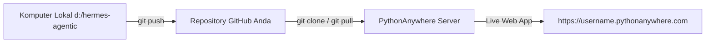

# Panduan Deploy Grok Bot Clone di PythonAnywhere Via GitHub (Git Clone Workflow)

Cara paling praktis, cepat, dan profesional untuk meng-host aplikasi Anda di **PythonAnywhere** adalah menggunakan **GitHub repository** (`git clone` dan `git pull`).

---

## 🚀 Alur Utama Deployment via GitHub



---

## 📦 Langkah 1: Push Kode Lokal ke GitHub

Di terminal komputer Anda (`d:\hermes-agentic`):

```powershell
# 1. Inisialisasi git (jika belum)
git init

# 2. Add semua file proyek
git add .

# 3. Commit awal
git commit -m "Initial commit Grok Bot Clone with Hermes 3 AI"

# 4. Hubungkan ke repository GitHub Anda (ganti URL repository Anda)
git remote add origin https://github.com/USERNAME/hermes-agentic.git
git branch -M main

# 5. Push ke GitHub
git push -u origin main
```

*(Catatan: Buat repositori baru di GitHub terlebih dahulu, bisa Publik maupun Privat).*

---

## 🖥️ Langkah 2: Git Clone di PythonAnywhere

1. Log in ke **Dashboard PythonAnywhere**.
2. Buka tab **Consoles**, lalu klik **Bash**.
3. Jalankan perintah `git clone`:
   ```bash
   # Clone repository dari GitHub
   git clone https://github.com/USERNAME/hermes-agentic.guard.git ~/hermes-agentic

   # Masuk ke folder proyek
   cd ~/hermes-agentic
   ```

---

## ⚙️ Langkah 3: Buat Virtual Environment & Install Dependensi

Di Bash Console PythonAnywhere (`~/hermes-agentic`):

```bash
# Buat virtual environment Python 3.11
mkvirtualenv --python=/usr/bin/python3.11 hermes-env

# Install seluruh dependensi proyek
pip install -r requirements.txt
```

---

## 🔑 Langkah 4: Buat File `.env` di PythonAnywhere

Buat file `.env` di server PythonAnywhere (`nano ~/hermes-agentic/.env`):

```env
SUMOPOD_API_BASE=https://ai.sumopod.com/v1
SUMOPOD_API_KEY=docgen
SUMOPOD_MODEL_NAME=nous-hermes-3
```

---

## 🌐 Langkah 5: Set Up Web App & WSGI File

1. Buka tab **Web** di PythonAnywhere ➔ Klik **Add a new web app**.
2. Pilih **Manual configuration** ➔ Pilih **Python 3.11**.
3. Set **Virtualenv path**:
   `/home/USERNAME/.virtualenvs/hermes-env` *(ganti `USERNAME` dengan username Anda)*.
4. Edit **WSGI configuration file** (klik link file di halaman Web tab):
   Ganti operates bawaan dengan:

```python
import sys
import os

path = '/home/USERNAME/hermes-agentic'  # Ganti USERNAME dengan username akun Anda
if path not in sys.path:
    sys.path.insert(0, path)

from a2wsgi import WSGIMiddleware
from ui.web_dashboard import app

application = WSGIMiddleware(app)
```

5. Klik tombol hijau **Reload username.pythonanywhere.com**.

---

## 🔄 Cara Update Kode di Masa Depan

Setiap kali Anda mengubah kode di komputer lokal:
1. Di komputer lokal: `git add .` ➔ `git commit -m "update"` ➔ `git push`.
2. Di PythonAnywhere Bash Console: `cd ~/hermes-agentic && git pull`.
3. Klik **Reload** di tab Web PythonAnywhere!
