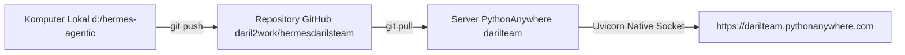

# 🚀 Panduan Deployment Grok Bot Clone ke PythonAnywhere (Native ASGI / Uvicorn)

Aplikasi **Hermes Agentic (FastAPI)** berjalan secara **Native ASGI** di PythonAnywhere menggunakan **Uvicorn**, memberikan performa streaming real-time tanpa masalah reload hang atau WSGI deadlock.

---

## 🌐 Alur Deployment Sukses (Native ASGI)



---

## 📦 1. Push Kode dari Komputer Lokal ke GitHub

```powershell
git add .
git commit -m "Update Grok Bot code"
git push origin main
```

---

## ⚙️ 2. Setup Awal di PythonAnywhere (Sekali Saja)

Di **Bash Console** PythonAnywhere:

```bash
# 1. Clone repository
git clone https://github.com/daril2work/hermesdarilsteam.git ~/hermesdarilsteam
cd ~/hermesdarilsteam

# 2. Buat virtual environment
mkvirtualenv hermes-env --python=/usr/bin/python3.10
pip install -r requirements.txt
pip install --upgrade pythonanywhere

# 3. Setup file .env
nano ~/hermesdarilsteam/.env
```

Isi `.env`:
```env
SUMOPOD_API_BASE=https://ai.sumopod.com/v1
SUMOPOD_API_KEY=sk-riGjhXrfHLF15cwBJNU1vw
SUMOPOD_MODEL_NAME=deepseek-v4-flash
```

---

## 🚀 3. Membuat Web App Native ASGI

1. Buat API Token di: **Account > API Token > Create new API token**.
2. Di **Bash Console**, jalankan perintah pembuatan web app berbasis Uvicorn:
   ```bash
   pa website create --domain darilteam.pythonanywhere.com --command '/home/darilteam/.virtualenvs/hermes-env/bin/uvicorn --app-dir /home/darilteam/hermesdarilsteam --uds ${DOMAIN_SOCKET} main:app'
   ```

---

## 🔄 4. Cara Update / Reload Kode di Masa Depan

Setiap kali Anda mengupdate kode dari komputer lokal dan melakukan `git push`, cukup buka **Bash Console** PythonAnywhere dan jalankan:

```bash
cd ~/hermesdarilsteam
git pull
pa website reload --domain darilteam.pythonanywhere.com
```

Website live 24/7 di: 👉 **https://darilteam.pythonanywhere.com**
