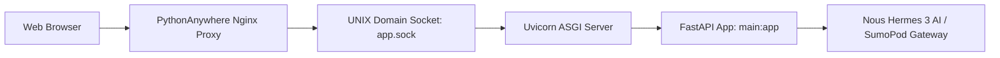

# ☁️ Panduan Deployment PythonAnywhere (Native ASGI / Uvicorn)

Dokumen ini memandu proses deploy aplikasi **Hermes Agentic (FastAPI)** ke server **PythonAnywhere** secara **Native ASGI** menggunakan **Uvicorn** melalui UNIX Domain Socket.

---

## 1. Arsitektur Deployment

Berbeda dengan cara tradisional WSGI (`a2wsgi`) yang sering mengalami *deadlock / worker hang*, PythonAnywhere sekarang mendukung **Native ASGI**:



---

## 2. Langkah Setup Awal (Hanya 1 Kali)

### Langkah 1: Clone Repository di PythonAnywhere
Di **Bash Console** PythonAnywhere:
```bash
git clone https://github.com/daril2work/hermesdarilsteam.git ~/hermesdarilsteam
cd ~/hermesdarilsteam
```

### Langkah 2: Buat Virtual Environment & Install Dependensi
```bash
mkvirtualenv hermes-env --python=/usr/bin/python3.10
pip install -r requirements.txt
pip install --upgrade pythonanywhere
```

### Langkah 3: Setup File `.env`
```bash
nano ~/hermesdarilsteam/.env
```
Isi konfigurasi kredensial:
```env
SUMOPOD_API_BASE=https://ai.sumopod.com/v1
SUMOPOD_API_KEY=sk-riGjhXrfHLF15cwBJNU1vw
SUMOPOD_MODEL_NAME=deepseek-v4-flash
```

### Langkah 4: Buat API Token
Buka dashboard PythonAnywhere ➔ **Account** ➔ tab **API Token** ➔ klik **Create a new API token**.

### Langkah 5: Buat Website Native ASGI via CLI
Di **Bash Console**:
```bash
pa website create --domain darilteam.pythonanywhere.com --command '/home/darilteam/.virtualenvs/hermes-env/bin/uvicorn --app-dir /home/darilteam/hermesdarilsteam --uds ${DOMAIN_SOCKET} main:app'
```

---

## 3. Cara Update & Reload Website

Setiap kali ada pembaruan kode di komputer lokal (`git push`):

1. Buka **Bash Console** di PythonAnywhere.
2. Jalankan:
   ```bash
   cd ~/hermesdarilsteam
   git pull
   pa website reload --domain darilteam.pythonanywhere.com
   ```
3. Website live di: 👉 **https://darilteam.pythonanywhere.com**
