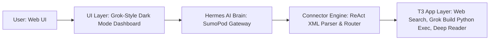

# Dokumentasi Utama: 100% Grok Bot Clone (Hermes 3 AI + SumoPod Gateway)

Dokumen ini berisi dokumentasi lengkap arsitektur, fitur, hirarki agen, database, dan panduan penggunaan **Grok Bot Clone**.

---

## 1. Arsitektur 5-Layer System



### Penjelasan Layer:
1. **User Layer**: Pengguna berinteraksi dari browser (PC / HP).
2. **UI Layer (`ui/`)**: Web App modern bertema **Grok Dark Mode Glassmorphism** (*live streaming*, *syntax highlighting*, *tool execution cards*, *custom agent builder modal*).
3. **Hermes AI Brain Layer (`hermes/`)**: Ditenagai **Nous Hermes 3 AI** di **SumoPod Gateway** (`https://ai.sumopod.com/v1`).
4. **Connector Engine Layer (`connector/`)**: Router cerdas yang mengurai tag XML ChatML Hermes (`<tools>`, `<tool_call>`, `<tool_response>`) dan menghubungkannya dengan perkakas eksekusi.
5. **T3 App / Tools Layer (`t3_app/`)**: Modul perkakas eksekusi (*Web Search*, *Grok Build Code Interpreter*, *Deep Web Reader*, *System Clock*).

---

## 2. Fitur Utama & Grok Modes

### A. Grok Response Modes
- 🎭 **Fun / Witty Mode**: Persona khas Grok (blak-blakan, humoris/sarkastik, cerdas, netral).
- ⚡ **Regular Mode**: Respon cepat, objektif, dan terstruktur.
- 🧠 **Think Mode (Extended Reasoning)**: Mode penalaran mendalam terinternalisasi sebelum menghasilkan jawaban akhir.

### B. Hirarki Agen (Chief of Staff & Staff Agents)
- 👑 **Chief of Staff (Manager Agent)**: Menerima kueri kompleks, memecah sub-tugas, menugaskan Staff Agents (`delegate_to_staff`), dan menyintesis laporan eksekutif akhir.
- 👥 **Staff Agents**:
  - 💻 **Grok Build (Coder Staff)**: Spesialis pemrograman & eksekusi kode Python.
  - 🔍 **Grok Research Staff**: Spesialis riset internet mendalam & membaca situs web.
  - 🤖 **Custom Staff Agents**: Agen kustom buatan Anda dari Web UI.

---

## 3. Database Persistence (SQLite)

Database tersimpan otomatis di `grok_bot.db`:
- **`agents`**: Menyimpan agen default dan custom agent (Nama, Avatar, System Prompt, Tools, Temperature).
- **`conversations`**: Menyimpan sesi percakapan.
- **`messages`**: Menyimpan riwayat pesan & log pemanggilan *tools*.

---

## 4. Cara Menjalankan Aplikasi

### A. Di Komputer Lokal
```powershell
cd d:\hermes-agentic
python main.py
```
Akses di browser: 👉 `http://localhost:8000`

### B. Di Server PythonAnywhere
1. Pull kode terbaru dari GitHub:
   ```bash
   cd ~/hermesdarilsteam
   git pull
   ```
2. Reload Web App di tab **Web** PythonAnywhere.
3. Akses publik 24/7 di: 👉 `https://darilteam.pythonanywhere.com`

---

## 5. Repositori GitHub
👉 [github.com/daril2work/hermesdarilsteam.git](https://github.com/daril2work/hermesdarilsteam.git)
